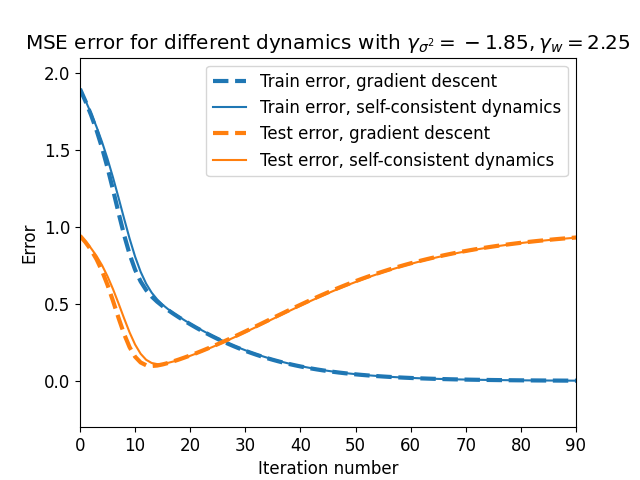
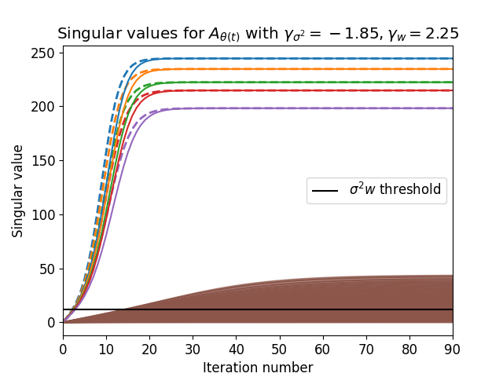
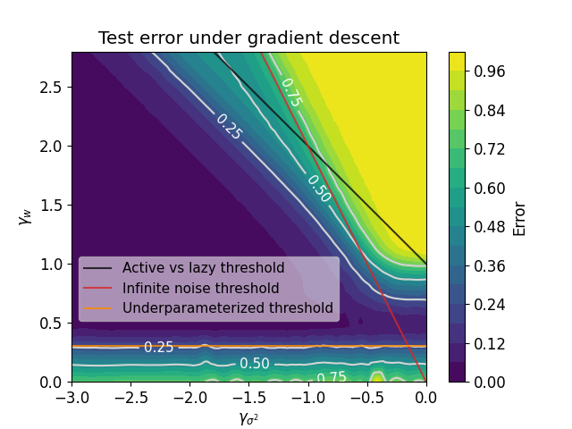
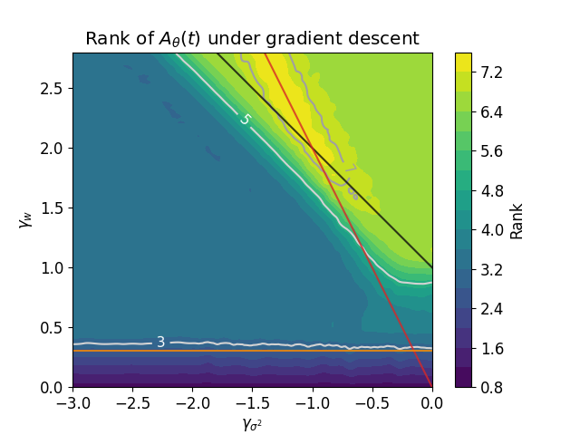
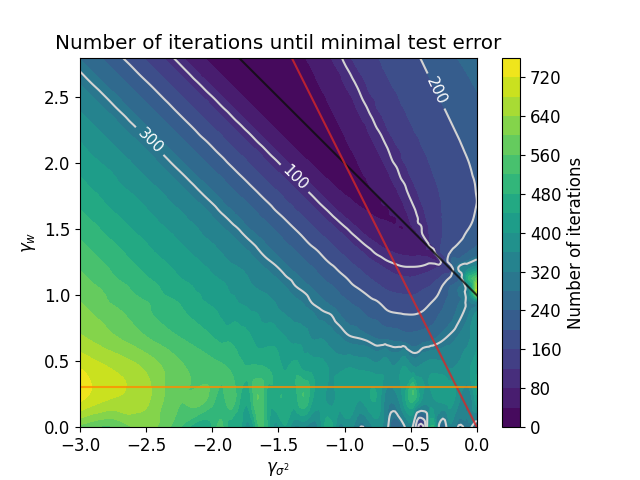
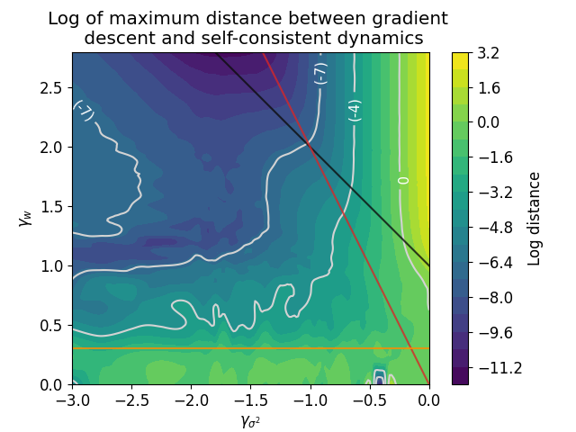

# Code for Mixed Dynamics In Linear Networks: Unifying the Lazy and Active Regimes
This is the official code for the experiments from the paper [Mixed Dynamics In Linear Networks: Unifying the Lazy and Active Regimes](https://arxiv.org/abs/2405.17580) by Z. Tu, S. Aranguri, and A. Jacot, published at NeurIPS 2024.

## Dynamics
The code at `dynamics.ipynb` trains a two-layer linear network using either gradient descent or the self-consistent dynamics in equation (1) from the paper, and compares the MSE error and singular values obtained by these two methods. This code is used to generate the following images (see Figure 1 in the paper.)

  
  

## Phase diagrams
The code at `main.ipynb` trains two-layer linear networks using gradient descent for different weight initializations and widths. The data is saved at `mse_exp.pickle` and it is used by the different notebooks in the `diagrams` folder to generate each one of the four following phase diagram (see Figure 2 in the paper) which are numerical evidence for Theorems 1 and 2 in the paper.

  
  

  
  

